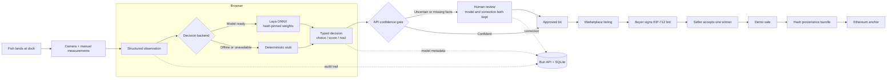

# ReelDeal

ReelDeal is a demo fish-market workflow for ETHGlobal Tokyo 2026. A dockside
operator captures a landing, an open-weights model running in the browser
returns a typed decision, uncertain results go to a human, and a completed
sale can be anchored on Ethereum for tamper-evident provenance.

No hosted model or paid AI API is required. The real decision backend is Laya
ONNX in the browser, with a deterministic local stub as the offline fallback.

The [GitHub Pages preview](https://superposition.github.io/reeldeal/) currently
shows static board and shop routes with clearly marked sample lots. Capture,
review, bidding, and chain anchoring are still being built; the preview does
not claim those flows work yet. Pushes to `main` build the Astro site with Bun
and publish `apps/web/dist` through GitHub Actions. The Bun API and SQLite do
not run on GitHub Pages and need a separate runtime for the live demo.

## Planned demo flow

The chain is used for the narrow question it answers well: who committed to a
lot record, when, and whether that record changed. Images, catalog data, bids,
and demo-denominated sales remain off-chain.

> **Scope:** this is a hackathon demonstration. No real fish, real payment, or
> production-grade species identification is claimed. Species labels remain
> operator-confirmed.
