# ReelDeal

ReelDeal is an ETHGlobal Tokyo 2026 fish-market **demo**. A browser records a
landing, a typed decision is stored with its inputs, the API sends incomplete
or uncertain lots to review, and approved lots can be listed. The model is
browser-local; GitHub Pages serves the Astro UI and a separate Bun API stores
demo state in SQLite.

No hosted model or paid AI API is required. The real decision backend is Laya
ONNX in the browser, with a deterministic local stub when Laya is unavailable.

## Open the demo

- [Shop on GitHub Pages](https://superposition.github.io/reeldeal/shop/) · [sample lot detail](https://superposition.github.io/reeldeal/shop/lot/?id=demo-lot-sanma) · [browser model lab](https://superposition.github.io/reeldeal/model/) · [intake](https://superposition.github.io/reeldeal/intake/)
- [Public API health](https://api-production-04b0.up.railway.app/v1/health) · [public listings](https://api-production-04b0.up.railway.app/v1/listings)

At the `675e03d` Pages build on 26 September 2026, the API returned four
explicitly synthetic listings, two open. The shop embeds only the public API
origin and fetches live listings in the browser; if that request fails it shows
clearly labelled preview cards, **not** persisted inventory. The Railway API
has a `/data` SQLite volume. The [deployment record](docs/deployment.md) gives
the exact boundary, checks, and recovery path.

This is not a production fish marketplace. The six seed records represent no
real fish, photographs, buyers, payments, or chain transactions. The prices
and sales are demo-denominated. Laya was fine-tuned for other typed-decision
workflows, not fish identification; species labels require an operator's
confirmation. No third-party fish-market or identity SDK integration is
claimed. The browser's reported model identity is audit evidence, not proof
that an untrusted browser actually executed those weights.

## Run locally

Use Bun, Make, and curl. Forge is optional unless you are testing contracts.
Start with a fresh clone and keep the demo database outside the repository:

```sh
git clone https://github.com/superposition/reeldeal.git
cd reeldeal
bun install --frozen-lockfile
RD_DEMO_DB="$(mktemp -d)/reeldeal.sqlite"
DB_PATH="$RD_DEMO_DB" bun scripts/seed.ts
DB_PATH="$RD_DEMO_DB" bun run --cwd apps/api start
```

`bun install` exits successfully. The seed prints `6 inserted, 0 already
present` on the first run and `0 inserted, 6 already present` on the second;
it creates only labelled synthetic fixtures. The API then listens on port
`8787`. Keep that terminal open. In a second terminal, run `make dev` and open
`http://localhost:4321/reeldeal/`; Astro prints its local URL. In a third
terminal, run:

```sh
API=http://127.0.0.1:8787/v1 make smoke
bun test --pass-with-no-tests
bun run build:web
forge test --root contracts # optional
```

The smoke test writes **additional synthetic records to that local database**.
It prints `health: {"ok":true,"db":"up","backends":{"decision":"stub"}}`,
then a published listing, `missing weight: pending_review → publish 409
(noul)`, and `SMOKE OK`. It is not a production-safe write test: do not point
it at the shared Railway API. The current checkout passed 68 Bun tests, nine
Astro static pages, and six Forge tests; see the ticket handoff for exact run
evidence. Do not use personal landing data in this demo.

Storybook is available at `http://localhost:6007/` with
`bun run --cwd apps/web storybook`. That command **builds static stories, then
serves them**. Stop and rerun it after source changes; Controls cannot mutate
Astro story args after the static build. This is a component workshop, not
proof of API-backed shop behavior.

## System path

```mermaid
flowchart LR
    A[Landing record] --> B[Photo + manual measurements]
    B --> C[Structured observation]

    subgraph Browser
        C --> D{Decision backend}
        D -->|Model ready| E[Laya ONNX<br/>hash-pinned weights]
        D -->|Offline or unavailable| F[Deterministic stub]
        E --> G[Typed decision<br/>choice / score / noul]
        F --> G
    end

    G --> H{API review gate}
    H -->|Uncertain or missing facts| I[Human review<br/>model and correction both kept]
    H -->|Eligible| J[Approved lot]
    I --> J

    J --> K[Marketplace listing]
    K -. planned .-> L[Buyer signs EIP-712 bid]
    L -. planned .-> M[Seller accepts one winner]
    M -. planned .-> N[Demo sale]

    C -. audit trail .-> O[(Bun API + SQLite)]
    G -. model metadata .-> O
    I -. correction .-> O
    N --> P[Hash provenance bundle]
    P --> Q[Ethereum anchor<br/>real transaction pending]
```



The diagram shows component responsibilities, not proof that every browser
step has been exercised end to end. The API owns lot/listing state and the
review gate. The chain would hold only a commitment and settlement evidence;
images, catalog data, bids, and prices remain off-chain. There is **no
deployed contract address or confirmed anchor yet**, and no ENS dependency.
See [architecture](docs/architecture.md), [decision pipeline](docs/decision-pipeline.md),
[ADR-001: browser decisions](docs/adr/0001-browser-decisions.md), and
[ADR-002: Pages plus Railway API](docs/adr/0002-pages-railway-api.md).

## Browser model: observed behavior and limits

The [model lab](https://superposition.github.io/reeldeal/model/) downloads the
approximately 291 MB q4e8 Laya weights **only after a click**, verifies the
reviewed SHA-256 pin, and caches verified bytes in browser Cache Storage.
GitHub Pages cannot set COOP/COEP headers directly; the user-triggered
`Enable threads & reload` action installs a base-scoped service worker so a
subsequent navigation can be cross-origin isolated. The worker uses up to four
WASM threads when isolated, otherwise one thread. The deterministic rule-based
sample remains available if the model cannot load.

These are measured browser observations, not build-only inferences: on the
deployed model route, headless Chrome 153 reported an isolated first download
and verification in 38.6 seconds, four threads, and a typed sample result;
the second load used the verified cache in 804 ms; disabling isolation used
one thread. [RD-13's runtime evidence](https://github.com/superposition/reeldeal/issues/32#issuecomment-5842574772)
records the exact run. That earlier model-route proof has not been repeated
against this README's Pages revision; fully network-disabled operation and
fish-specific accuracy remain **unverified**. A model sample is not a fish
grade or species classifier.

## Remaining demo gates and attribution

A real camera capture and cross-session scan-to-listing demonstration still
need runtime proof. Signed bids, seller acceptance, and demo settlement remain
pending routes; the diagram marks that planned path. Chain anchoring needs a funded signer, RPC, verified
receipt, contract addresses, and explorer links; the local Forge simulation
is not an on-chain transaction. The final video and submission are pending.
The shared demo API has no seller authentication on ordinary write routes;
CORS protects browser origins, not direct HTTP clients. Use only consenting
demo data and do not publish an operator token, RPC credential, or private key.

The Laya reference implementation is vendored under Apache-2.0 with its
[license](packages/decision/vendor/laya/LICENSE),
[notice](packages/decision/vendor/laya/NOTICE.md), and
[provenance record](packages/decision/vendor/laya/PROVENANCE.md). Visual
inspiration from prior personal work; implemented during the hackathon.
