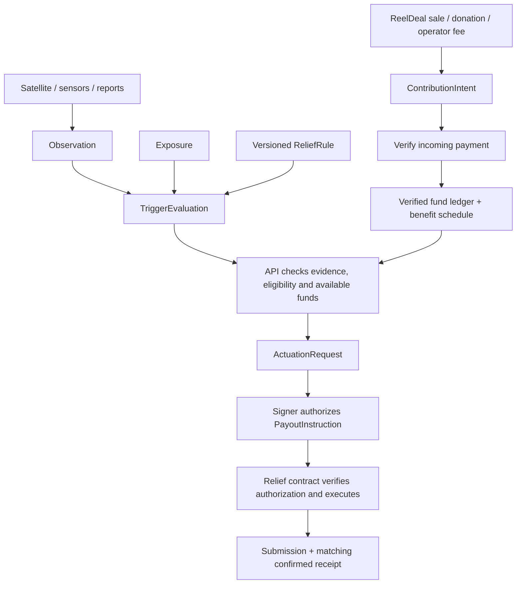

# Umi: atoms → molecules → organisms

Status: **first draft of the shared data model**. Runtime Zod schemas and
inferred TypeScript types live in [`packages/domain/src/umi`](../packages/domain/src/umi).
The schema names describe domain data; UI components can consume them later.

Umi is the relief fund described in the project brief. ReelDeal is its
local-products funding channel. The present checkout implements a marketplace;
these new types establish the proposed Umi interface. There is no Umi ingestion
service, trigger evaluator, fund ledger, or payout execution in this change.

## 1. Atoms: one value with one meaning

| Atom | Representation | Meaning / constraint |
|---|---|---|
| Identifier | Nonempty string | An opaque reference; names are display data |
| Timestamp | ISO datetime with timezone | An instant; readers compare instants across offsets |
| Latitude / longitude | Finite numbers in degrees | Latitude −90…90; longitude −180…180 |
| Fraction | Number from 0 to 1 | Coverage; interpretation belongs to its named field |
| Seconds | Nonnegative safe integer | Duration, or Unix time when explicitly named |
| JPY | Nonnegative safe integer | Whole yen, shared with the marketplace |
| Chain ID | Positive safe integer | Identifies the execution network |
| EVM address | `0x` + 20 bytes | Address syntax only; ownership is checked by the service |
| Bytes32 | `0x` + 32 bytes | Contract key or digest; derivation belongs to the protocol |
| SHA-256 | 64 lowercase hex characters | Digest of the exact source artifact bytes |
| Uint256 | Canonical decimal string | Exact base units or nonce, from 0 through 2²⁵⁶−1 |
| Source kind | Satellite / sensor / government report | Provenance category |
| Data mode | Observed / forecast / hindcast | How a value relates to observation or modelling |

Atoms validate their own representation. A valid coordinate alone does not
establish that a site is inside Japan's EEZ, and a valid address does not
establish that it belongs to an eligible beneficiary.

## 2. Molecules: a useful combination of atoms

| Molecule | Composition | Question it answers |
|---|---|---|
| `Point` | Latitude + longitude | Where is the representative point? |
| `TimeWindow` | Start + end, start included / end excluded | Which interval is described? |
| `VersionedRef` | ID + version | Which exact definition was used? |
| `Measurement` | Metric + fixed unit + finite value | What quantity was measured or estimated? |
| `Reading` | Present measurement **or** missing metric + reason | Do we actually have a value? |
| `EvidenceRef` | URI + artifact SHA-256 + optional locator | Which original bytes and record support this? |
| `DataSource` | Kind + publisher + product + version | Who produced the input? |
| `Quality` | Status + explanation + calibration reference | What validation accompanies it? |
| `Threshold` | Limit + comparison + aggregation + duration + coverage | What constitutes a crossing? |
| `ChainAsset` | Native asset or ERC-20 address | Which asset on the instruction's chain? |

The initial measurement vocabulary is deliberately small:

```ts
type Measurement =
  | { metric: 'water_temperature'; unit: 'degC'; value: number }
  | { metric: 'significant_wave_height'; unit: 'm'; value: number }
  | { metric: 'wind_speed'; unit: 'm/s'; value: number }
  | { metric: 'chlorophyll_a'; unit: 'mg/m3'; value: number };
```

Each source adapter converts into these units and keeps the original artifact.
Adding a new quantity requires its identity and unit. Algal cell counts need a
taxon; toxin concentrations need an analyte. Those types are still to be defined.
The draft does not treat chlorophyll concentration as proof of harmful toxins.

There are no species tolerance values or live payout thresholds in this draft.
`mean`, `minimum`, and `maximum` apply over the rule's window; the future evaluator
must specify sampling, time weighting, spatial matching, and gap handling.
The schema requires a coverage fraction and maximum gap, but does not calculate them.

## 3. Organisms: records that connect the workflow

| Organism | Composition | Owner / purpose |
|---|---|---|
| `Observation` | Source + target time + location/depth + reading + quality + method + evidence | Pipeline: one traceable environmental value or explicit absence |
| `Exposure` | Beneficiary + versioned site + species + equipment + active interval | Application: what is exposed and during which period |
| `ReliefRule` | Species/equipment + hazard + threshold + evidence requirements + benefit schedule | Fund configuration: which conditions apply |
| `TriggerEvaluation` | Exposure + pinned rule + evidence IDs + window + mode + result | Evaluator: crossed, not crossed, or indeterminate |
| `ContributionIntent` | Fund + whole-yen amount + donation/fee/sale origin | Funding application: proposed contribution with a ReelDeal sale link when applicable |
| `ActuationRequest` | Evaluation + beneficiary + allocation + idempotency key + payout instruction | API: request to authorize and execute a specific allocation |
| `PayoutSubmission` | Request + chain + transaction hash + submission time | Executor: evidence that a transaction was submitted |

An observation retains target/sample time, issuance time, and ingestion time
separately. A forecast can describe a future target window; a hindcast can
describe a past one. Missing readings carry a reason. Unknown depth is `null`;
surface depth is explicitly `0`.

Sites and equipment are versioned references because location/footprint and
equipment definitions need their own records. Raster and area observations can
reference their footprint; the representative point is insufficient to establish
overlap with a farm. Sensors and government reports carry quality evidence too.

An indeterminate evaluation can have no observations. A determinate result must
cite observations and a statistic. These schemas validate the reported shape;
they do not recompute the result or verify the referenced rows.

## 4. Where the actuation API and smart contract meet



This is the intended flow. The present implementation supplies the data schemas.

The proposed `PayoutInstruction` contains the chain ID, pool address, event key,
beneficiary address, asset, exact amount in base units, rule/evidence digests,
nonce, and expiry. The API owns the detailed observations and allocation record;
the contract receives the bounded instruction it can verify and execute.

Before signing, the API must resolve the stored evaluation and rule, check their
binding to the exposure, require an eligible observed crossing, verify evidence
quality/freshness/coverage, check beneficiary eligibility and wallet binding,
reserve the allocation, and prevent a second allocation for the same entitlement.
Forecast and hindcast evaluations support analysis; this proposed payout path
accepts observed evaluations only. Client-supplied results cannot authorize funds.

The future contract must verify its chain/pool domain, signer authority, expiry,
event/beneficiary entitlement, replay protection, supported asset, and available
balance. An idempotency key handles API retries; a consumed nonce handles replay;
an entitlement key prevents paying the same benefit again with a fresh nonce.
These checks require runtime code and persistent state beyond schema parsing.

A transaction hash records submission. The application marks funds released
only after matching the successful receipt/event to the instruction under a
defined confirmation policy. A contribution intent likewise needs incoming
payment verification before it changes the fund balance.

### Decisions still needed before execution

- Source products and adapters; calibration records and data quality methods.
- Versioned site footprints and Japan EEZ membership; species and equipment catalogs.
- Species/equipment thresholds, sampling semantics, benefit schedules and funding limits.
- Event identity and entitlement derivation; canonical serialization and digest algorithms.
- Exact Solidity structs/ABI and signing format, signer management and nonce scope.
- Asset/network choice, token decimals, any JPY conversion, confirmation and reconciliation rules.

The current `ListingBook` and `ProvenanceRegistry` do not release relief funds.
`PayoutInstruction` is a draft boundary to reconcile with the actual Umi contract.
Its `schema_version: 1` identifies this proposed payload; it does not change the
existing marketplace HTTP `/v1` contract. A whole-yen contribution is never
implicitly cast to a token amount.

## Use in code

```ts
import { umi } from '@reeldeal/domain';

const reading: umi.Reading = umi.ReadingSchema.parse({
  state: 'missing',
  metric: 'water_temperature',
  reason: 'cloud masked',
});
```

Existing marketplace exports remain available. Umi's environmental `Observation`
is namespaced to distinguish it from ReelDeal's fish observation.

Run the focused schema checks with `bun test packages/domain/test/umi.test.ts`.
They exercise unit mismatches, absent data, time offsets, provenance, coverage,
indeterminate evaluations, exact amounts, and the draft actuation envelope.
